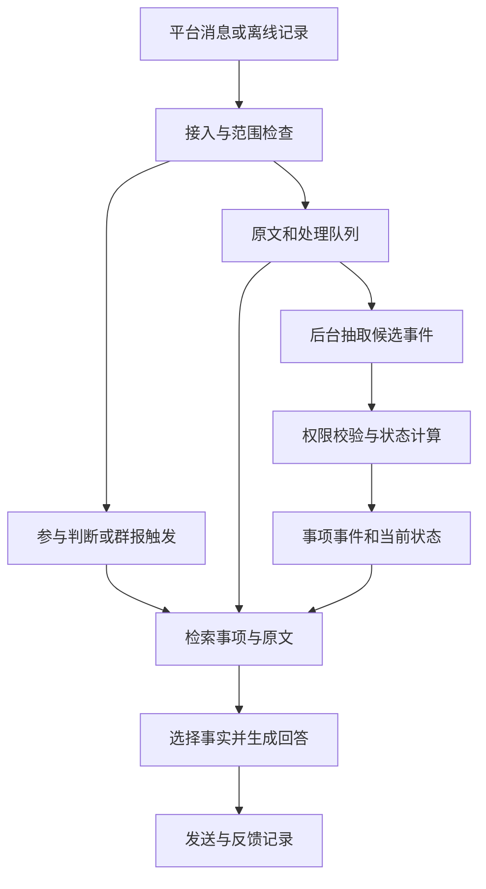

# AIE3905 企业群聊助手｜项目交接文档

更新：2026-09-27（Asia/Shanghai）  
读者：没有参与前期讨论的新组员  
方案依据：v0.3 初步实施方案及后续决定  
代码依据：`AIE3905_GroupBot_v0.1.0.zip`，开发版本 0.1.0

**我们正在做一个基于 AstrBot 的群聊助手：记住重要事项、追踪变化、回答时给出依据，同时让成员愿意与它交流。已有可运行的开发版本；接下来要验证真实模型和真实群接入，再用产品效果争取企业合作。**

本文替代此前停留在“原型筹备”的交接版本。正文包含接手所需的背景、选择理由、工程现状和下一步；无需先补读历史聊天。运行程序仍需取得源码包，入口见第 12 节。

## 1. 先掌握这几个事实

| 问题 | 当前答案 |
| --- | --- |
| 这是什么项目？ | AIE3905 校企合作项目，合作对象为深圳平安创配；目标服务企业内部工作交流。 |
| 企业最终希望什么？ | 扩展现有数字员工，改善业务沟通理解、专业知识使用和客户交流体验。 |
| 我们先交付什么？ | 重要性排序、群报、当前结论查询、历史回溯、基本互动和纠正反馈。 |
| 为什么不直接做外部 AI 客服？ | 外部场景还叠加图片、语音、汽配知识、SOP 和真实业务操作。先验证共用能力，便于定位错误、积累数据与经验。 |
| 企业已经同意内部试点了吗？ | **尚未确认。** 企业数据敏感，当前策略是先做效果，再争取专家评审、内网回放或小范围试用。 |
| 现在有什么可交接？ | AstrBot 插件、独立记忆核心、本地审核页、离线回放、功能评测和测试代码。 |
| 哪些已经验证？ | 本地规则演示、38 项自动测试、7 个功能回归案例；本次交接重新运行通过。 |
| 哪些还没验证？ | 真实模型理解质量、完整 AstrBot 宿主运行、飞书／QQ／企业平台接入、浏览器实际交互、大群负载。 |
| 算力到位了吗？ | 约 4 张 RTX 5090 是拟申请资源，尚未获批；MVP 不以它到位为前提。 |
| 新成员先做什么？ | 跑通本地演示，理解一个事项如何变化，再认领真实模型、平台接入或评测中的一个任务。 |

阅读顺序：先读第 1—3 节理解方向；用第 5—6 节确认现状并运行；开发时查第 4、7 节；安排工作和对外沟通看第 8—11 节。

## 2. 企业想解决什么，我们为什么这样收敛

### 企业背景

平安创配连接汽车维修厂、汽配供应商和内部业务人员。沟通中有不标准的配件叫法、照片、短回复和多个并行需求。2026 年 9 月 22 日会谈介绍的数字员工，主要在员工忙碌时托管部分对话：识别客户意图、整理配件需求、追问缺失信息，再衔接企业询报价流程。

企业描述了内部自研 IM、内网要求及与外部微信沟通的连接。白板草图可辨认出微信、IM、AI／AgentScope、意图识别、Skill 和 Tools。它说明了职责关系，**不能据此确定接口、部署方式或接入权限**。企业演示与口头介绍也不等于所有功能都已经稳定运行。

初次会谈的范围很大。此前归纳的相关方向包括：智能询报价、汽配知识库与知识图谱、需求预测与补货、库存协同、拆车配件图像识别、资金台账与预警、维修厂信息整合、采购价格合理性分析，以及群内业务分析。这里是主题归纳，不是企业正式确认的九项交付清单。这些方向不自动进入本项目范围。

与当前课题最相关的三类技术问题是：

| 企业关注点 | 本项目怎样响应 |
| --- | --- |
| 长文本的前后一致和稳定 | 在多人、多事项交错时，关联对话，维护有效结论、变化和来源。讨论中的 alignment 主要指这种一致性。 |
| 专业知识可供 AI 使用 | 先处理必要的术语与群规则，之后再扩展行业知识。向量化只是检索手段之一。 |
| 表达自然、专业、让人愿意继续沟通 | P0 就保留稳定风格和适度互动；专业客服语料训练后置。 |

### 为什么先做群助手

工作群的直接痛点是：一句重要决定和几十条闲聊占据相似的展示空间；成员回来后既要找信息，还要判断哪个版本仍然有效。群报和查询可以直接减少这部分负担，也便于核对系统有没有漏记、串话或沿用旧结论。

外部数字员工也需要理解上下文、保留有效信息和记住变化，同时还要处理图片、语音、行业知识和业务操作。这形成了能力上的包含关系，但并不意味着内部群做完就能直接接管外部业务。先拆开验证共用能力，之后出错时，才更容易分清是原有能力不足，还是新增识别、知识或流程出了问题。

早期还需要一个能持续试用、纠正和积累失败案例的环境。直接面向客户时，错误可能影响报价和经营，试错空间有限。先做群助手，既有短期使用价值，也能建立后续扩展需要的经验。

### 讨论中已经发生的调整

| 最初的想法 | 当前决定及原因 |
| --- | --- |
| 先做业务信息过滤／清洗层 | 交付完整的群助手。信息筛选只是模块，成员的使用体验同样是核心目标。 |
| 尽快进入企业内部群迭代 | 企业数据敏感，先用获准的社群记录和完全虚构的工作场景做效果，同时协商企业合作。 |
| 游戏群做好，企业迁移主要靠时间 | 底层机制可以复用；重要性、确认权限、术语、参与分寸仍需用目标场景校准。 |
| 期待能力通过 RL 涌现 | P0 先形成产品、反馈和评测；P1 再选有限任务研究学习策略。不能承诺越用越好。 |
| 采用成熟框架就能获得成熟体验 | 已选择 AstrBot 作为工程基础；事项记忆、事实依据和互动效果仍由本项目实现与验证。 |

旧稿中的 Priority 1／2／3 曾分别指内部群、外部业务群和客服表达。现在统一使用：**P0 是当前群助手；P1 是训练与自动改进；外部业务扩展另行定范围。** 自然互动一直属于 P0，没有被推迟到客服专项训练阶段。

## 3. 产品应该让人感受到什么

**信息找得回来，变化记得清，交流有分寸。** 这三件事必须同时成立。

| 能力 | 目标体验 |
| --- | --- |
| 关键信息与重要性排序 | 决定、变更、截止日期和阻塞优先呈现。重要性依据影响和行动需要，不等同于讨论热度。 |
| 群报与离线补课 | 问“我不在时有什么变化”，同一事项合并展示，突出最新变化和待确认内容。 |
| 信息查找与回溯 | 问“最后怎么定的”“为什么改”“谁负责”，得到当前结论、必要历史和原文依据。 |
| 自然互动 | 接对话题和对象，保持稳定风格；明确被问到时回应，必要时简短澄清。 |
| 纠正与反馈 | 能指出记错、过时、漏重点、太啰嗦或不该插话，并查看处理结果。 |

### 一个贯穿设计的例子

以下为虚构的工作场景，用来说明目标，不是企业原文，也不是已经完成真实模型验证的记录。

小林请假两天，回来看到 300 条未读。他问“我错过了什么？”助手应先说明：演示改期了，负责人已确认，但具体几点还没定。追问“为什么改”，应能找回当时的原因和确认消息。

| 消息 | 应当怎样记 |
| --- | --- |
| 负责人：“周五下午演示。” | 初始安排。 |
| 同事：“数据还没齐，改到下周二可以吗？” | 变更提议，不能直接覆盖安排。 |
| 负责人引用提议：“可以。” | 结合引用和确认权限更新安排；保留原因与历史。 |
| 一位成员：“我周二来不了。” | 更新此人的参与状态，不取消活动。 |
| 另一位成员：“听说演示取消了。” | 依据不足时待确认，不能因为消息最新就覆盖已确认状态。 |

回答新安排时不能把旧版本的“下午”自动带到周二。撤回某条变更，也不等于活动取消或旧安排自动恢复。

### 怎样理解“有人情味”

用户分享过 Anon／爱音的群聊片段：能使用成员称呼、提醒群公告、介绍技术资料，也能用稳定角色语气接玩笑。这些片段提供了体验目标，但不能反推出模型、记忆架构、搜索工具或作者公开代码。

值得借鉴的是对交流对象、目的、语气和长短的判断。企业助手不必照搬动漫人设；“只负责可爱”如果回避了明确工作请求，也不能算完成任务。长期记忆和自然互动分别评测，不能用几条好看的回复证明整体可靠。

工作事实单独整理，获准范围内的近期闲聊仍用于理解语境。长期偏好优先来自明确表达；首版尚未实现完整的个人偏好学习。首轮以文字、列表、来源和审核页为主，复杂卡片、图表后续按需要增加。

**P0 不包含：** 自动下单、报价、议价、商品上架、复杂配件图识别，以及自动改写自身权重或代码。也不替代企业现有数字员工。

## 4. 系统怎样工作

采用 **AstrBot + 一个核心插件 + 独立记忆核心和存储**。第一版是单进程工程，不需要先拆成多个服务。



后台持续整理获准消息，前台只在需要时回应。不能只监听“准备调用模型”的钩子，否则沉默时的讨论不会进入记忆。

### 三层记忆

1. **原文证据**：保存消息、稳定身份、时间、引用和附件状态，供回查；按约定删除或到期清理。
2. **事项事件**：记录提议、确认、变更、取消、完成、更正、个人状态等，并关联来源和模型／提示版本。
3. **当前状态**：根据有效事件和群的确认规则计算。当前状态不简单等于最后一条消息。

模型提出候选修改，程序检查来源、群边界、确认权限和字段后再写入。程序能拒绝无效写入，却不能保证语义归属一定正确，仍需审核和回放。

### 当前模型与规则分工

| 角色 | 现有实现 | 后续验证重点 |
| --- | --- | --- |
| 规则 | 明确命令、引用、时间线索、启用范围、确认权限、基础参与策略。 | 避免规则误伤短回复；平台字段必须真实可用。 |
| 理解模型 | 返回 JSON 候选事件，结合近期消息和候选事项关联讨论。 | 中文交错对话、隐含更正、同名事项、JSON 稳定性。 |
| 回答模型 | 工作回答选择程序提供的事实 ID 和开场句；程序呈现关键字段。闲聊另走 persona 路径。 | 是否选对事实；受约束表达能否兼顾准确与自然。 |
| 检索与存储 | SQLite、FTS5／BM25 和中文二元词片；缺少 FTS5 时回退关键词扫描。 | 长期召回、同义表达、队列积压和总体成本。 |

小模型与主模型是职责划分，可以先共用一个服务。代码支持 OpenAI 兼容接口或 AstrBot Provider，未绑定最终型号，也未训练权重。Qwen 4B／9B 级模型只是此前讨论的候选，不能把候选写成已经部署。

### 必须保持的状态规则

- 先关联语境，再判断价值。“可以”可能比一段长消息更关键。
- 确认规则来自配置：指定成员或事项发起人。没有明确投票规则时，不自动认定多数共识。
- 区分系列、某一次安排和个人状态。某人缺席不等于事项取消。
- 时间使用消息时间和群时区解释，同时保留原始表达；含糊时说明未知。
- 更正指向旧事件；撤回使依赖证据失效，缺少独立确认时标为不确定。
- 正式写入统一由后台处理，消息与事件幂等，状态和处理进度在同一事务提交。
- 检索和送入模型前先检查群范围。首版不做跨群混合查询。

配置允许游戏群与工作群使用不同术语、确认人、排序和参与方式。这提供迁移入口，迁移是否有效仍须实测。

## 5. v0.1.0 做到了哪里

下表区分“存在代码”和“在真实环境验证通过”。未注明真实验证的能力，都只代表开发版本中的实现与本地测试。

| 范围 | 已有实现 | 尚未完成或未验证 |
| --- | --- | --- |
| AstrBot 接入 | 普通消息事件入口、ID 映射、关闭指定群的默认模型回复、发送路径。 | 完整宿主运行、真实飞书／QQ／企业适配器。未送达插件的消息无法补造。 |
| 事项记忆 | 提议／确认／改期／取消／更正，个人状态与单次范围，撤回依赖处理。 | 自然语言抽取准确率、复杂周期、自动共识；同名事项需要进一步处理。 |
| 查询与群报 | 当前结论、历史、原文检索、追问、排序、手动群报；插件内可配定时群报。 | 真实用户问法与排序标准；平台定时送达和原文深链接。 |
| 互动 | 明确唤醒、少量寒暄和 `/聊`，可配置风格；冲突提醒默认关闭。 | 长期自然度、用户偏好学习、训练过的发言判断器。 |
| 审核与反馈 | 本地网页、事项时间线、待确认事件、最近原文抽查、反馈归档。 | 浏览器实际点击和视觉验收；团队持续使用。 |
| 数据控制 | 群隔离、令牌范围、退出记录、删除及重放阻止、到期清理。 | 企业认证体系、平台／宿主／其他插件／备份／模型服务副本的统一管理。 |
| 评测与运行 | 顺序回放、断言、测试、真实模型基线比较入口、处理状态和用量记录。 | 真实模型基线结果、语义标注、大群负载和并发容量。 |

### 相比 v0.3 计划，首版的具体取舍

| 计划中的方向 | 当前代码做法及影响 |
| --- | --- |
| 后台分批理解 | 当前以逐条增量处理为主，使用近期窗口；尚未完成短窗口批量模型调用。成本与积压需要测量。 |
| 原文＋向量检索 | 当前先用 FTS5／BM25；未接入 embedding 或向量库。 |
| 查询超时后构造临时状态视图 | 默认等候前序处理至多 8 秒；超时使用已处理状态并说明覆盖不完整。未实现临时推导视图。 |
| 自由生成后逐字段核对 | 工作回答先让模型选事实，再由程序呈现。更便于核对，但表达自由度有限。 |
| 独立、可维护的事项身份 | 当前事项 ID 由群和规范化标题构成。同名独立事项可能合并，需不同标题或进一步实现别名、拆分与合并。 |
| 无原生 ID 的去重 | 离线数据按文件摘要和行号生成替代 ID。文件修改或重排会改变身份，跨导出重复不能可靠自动合并。 |
| 相对时间规则库 | 当前为自带的保守解析器，没有集成 JioNLP。复杂表达需要模型与人工核对。 |
| 截图提取 | 只保存“附件未处理”的状态，没有视觉识别。 |

这些差异是后续开发起点，不要继续把完整方案中的功能都写成“已完成”。

## 6. 新成员怎样运行和接手

### 6.1 取得代码并运行本地演示

取得第 12 节的 `AIE3905_GroupBot_v0.1.0.zip`，解压到独立目录。如果私有链接无法访问，向转交本文的人索取同版本源码包；源码未取得前，先做虚构案例设计。ZIP 根目录应直接包含 `main.py`、`README.md` 和 `secretary/`。以下命令都在解压后的项目根目录执行。

独立核心需要 Python 3.11+，建议 3.12；没有第三方 Python 依赖。Windows 若缺少时区数据，需安装 `tzdata`。完整 AstrBot 宿主需另行安装，代码交付记录的接口依据为 4.28.1／Python 3.12+；升级前需要重新核对兼容性。

```bash
python3 -m secretary demo
```

预期结果：终端展示演示的最新安排、改期原因、个人缺席和一条未获确认的取消，附来源。日期按运行时生成，不要求与本文的虚构场景一致。这个命令使用临时数据，不需要账号或模型密钥。

```bash
python3 tools/start_demo.py
```

打开终端显示的地址（默认 `http://127.0.0.1:8765`），在连接框填入本次生成的令牌，点击“导入虚构演示”。先问“产品演示现在怎么定的”，再问“为什么改期”，查看事项时间线、依据和反馈入口。

网页演示数据保存在 `data/demo.sqlite3`，重复导入不会重复记事。令牌只用于自己的运行环境，不写入文档或提交到代码中。

**规则演示识别的是明确命令和少量示例语法。它能证明程序流程可运行，不能证明任意真实聊天已经能被理解。**

### 6.2 复现检查

```bash
python3 -m unittest discover -v
python3 -m secretary.evaluate --config examples/demo.config.json --input examples/replay.jsonl --cases examples/cases.json --output evaluation.json
```

本次重新运行得到 38 项测试通过、7 个功能案例通过指定断言。这些案例主要采用明确命令和虚构消息，自动评分检查内容与来源 ID，不是企业语义准确率。还需在自己的浏览器完成一次导入、查询、确认和反馈操作。

### 6.3 配置真实模型

复制 `examples/local-model.config.json` 为项目根目录的 `config.json`，替换以下字段：

| 字段 | 怎样填写 |
| --- | --- |
| `models.understanding`、`models.answering` | 获准服务的地址和实际模型 ID；可以暂时共用模型。 |
| `api_key_env` | 保存密钥的环境变量名；密钥不直接写入配置。 |
| `json_mode` | 默认启用。服务不支持 `response_format` 时可关闭，但返回仍须是可解析 JSON。 |
| `database` | 相对配置文件目录解析。配置从 `examples/` 移到根目录后，应改成如 `data/local-model.sqlite3`，避免意外写到项目外。 |
| `groups` | 群配置 key、平台实例 ID、原生群 ID、稳定用户 ID、确认人、时区和保留期限。 |
| `processing_location` | 写实际处理地点，不能保留示例文字。 |
| `enabled`、`data_use_confirmed` | 实际范围与用途确认后才启用；它们只是开关，不替代授权。 |

默认示例使用本机 OpenAI 兼容地址。远端服务需要 `allow_remote: true` 和 HTTPS，数据处理地点需在告知与授权范围内。AstrBot Provider 则使用 `examples/astrbot.config.json` 的 `provider_id`，只能在插件内运行。

```bash
python3 -m secretary replay --config config.json --input your-authorized-records.jsonl
```

`your-authorized-records.jsonl` 是需要自行准备的获准记录，不是包内文件。首批模型实验可先用完全虚构的自然对话；不要仅把规则命令换一个模型跑，就声称测过自然语言。

### 6.4 接入 AstrBot

1. 将解压目录放为 AstrBot 的 `data/plugins/astrbot_plugin_groupsecretary`。
2. 首次加载后，插件会在 `data/plugin_data/astrbot_plugin_groupsecretary/config.json` 创建配置，默认不读取任何群。
3. 填写模型、群和用户 ID；`platform_id` 是适配器实例 ID，不是笼统的“飞书”或“QQ”。也可用插件的 `config_path` 指定配置绝对路径。
4. 重载后先发普通消息，再测试 @、引用、查询与重复推送。
5. 按源码中的 `docs/ADAPTER_CHECKLIST.md` 逐项记录实际结果。

插件关闭的是 AstrBot 默认 LLM 回复，其他插件仍可能发言。试点群应只保留一条负责 AI 回答的流程。

撤回事件未进入普通消息入口时，需要适配器调用 `ingest_recall(platform_id, group_id, native_id)`。代码已处理送达的 OneBot `group_recall` 转换，飞书独立撤回桥接仍需接通。编辑要转为带新 `revision` 的 `edit`，不能用相同 ID 静默覆盖。

**同一数据库只运行一个 Engine。** 不要让独立服务与 AstrBot 同时写同一库；需要网页和 Bot 一起工作时，在插件内开启审核页。网页默认仅绑定本机，访问令牌至少 24 字符。

### 6.5 常用入口

```text
/秘书帮助
/秘书状态
/事项
/问 产品演示现在怎么定的
/回溯 产品演示为什么改期
/群报 1
/原文 消息ID
/聊 今天大家很累，说句简短的鼓励
/记事 产品演示 | 提议 | 时间=2026-10-02;优先级=5
/确认 事件ID
/反馈 回答ID 找错了 这次引用的是旧安排
```

也支持引用原消息后说“这条记住”或“这个已经过时了”。权限不足的变更保持待确认。优先级为 1—5，字段用英文分号分隔。

管理员可用 `/忘掉 事项ID 确认` 删除事项；成员可用 `/别记我` 停止记录并清理本插件内相关内容，或 `/恢复记录` 重新允许后续记录。恢复记录不会找回已删除内容。删除及范围限制见第 9 节。

## 7. 开发时去哪里改，怎样定位问题

| 文件或目录 | 职责 |
| --- | --- |
| `main.py`、`metadata.yaml`、`_conf_schema.json` | 插件入口、生命周期、收发、宿主配置。 |
| `secretary/types.py`、`config.py` | 标准消息与事件类型、配置和启用条件。 |
| `secretary/store.py` | 原文、事件、检索索引、去重、处理进度、反馈和删除。 |
| `secretary/extract.py`、`memory.py`、`timeparse.py` | 事件候选、确认规则、状态计算、时间解释。 |
| `secretary/engine.py` | 队列、后台处理、查询、命令、群报和任务关闭。 |
| `secretary/providers.py`、`answer.py` | 模型接口、事实选择、工作回答与闲聊风格。 |
| `secretary/web.py`、`secretary/ui/` | 本地审核 API 与网页。 |
| `secretary/cli.py`、`evaluate.py`、`sample.py` | 独立运行、回放、功能评测与虚构样例。 |
| `examples/`、`tests/`、`docs/` | 配置、数据、案例、测试、架构及接入检查说明。 |

标准 JSONL 每行一条消息，例如：

```json
{"group":"pilot","native_id":"m-102","sender":"u-17","name":"小林","at":"2026-09-27T09:00:00+08:00","text":"演示改到周二了吗？","reply_to":"m-100"}
```

`sender` 是稳定 ID，`name` 只用于展示，时间必须带时区；`reply_to` 指向同群原生消息 ID。无原生 ID 的数据需标注替代身份的限制。撤回使用独立记录及 `target_id`；附件目前标为未处理。只有昵称的数据不能自动猜同名用户身份。

审核 API 包括 `GET /api/items`、`/api/messages`、`/api/message`、`/api/status`，以及 `POST /api/query`、`/api/command`、`/api/feedback`。均须携带 Bearer 令牌并满足群范围。管理员 `/api/ingest` 是回放入口，**不是可直接向外暴露的企业 Webhook**；企业推送还需签名校验、重放防护和身份映射。

| 现象 | 优先检查 |
| --- | --- |
| 未 @ 时不记事 | 平台是否推送 → 适配器是否收到 → 插件群范围是否匹配。 |
| 答非所问 | 引用关系、候选事项、当前输入；特别检查同名事项与简短追问。 |
| 返回旧安排 | 消息是否处理成功、确认权限、撤回依赖、有效状态和实际检索结果。 |
| 查不到重要内容 | 原文是否存在 → 有没有漏提取 → 是否召回 → 是否选错事实。 |
| 持续出现覆盖不完整 | 队列、失败状态、未结构化消息和附件；不要一概当作模型故障。 |
| 回复两次或定时群报重复 | 默认回复与其他插件、重复推送、平台发送与本地记账的崩溃边界。 |
| 风格生硬或太啰嗦 | 模型 persona、事实模板、参与判断分别检查；不要只加强“拟人”提示。 |
| 小模型调用后仍很慢／很贵 | 计入后台逐条抽取、重试、回答、基线调用和积压，不能只看前台请求。 |

处理进度表示最后完成的序号，不保证之前每条都成功；还要看 failed、待办和附件状态。模型失败默认有限重试，不应无限重试。修复时记录输入、代码／模型／提示版本、预期、实际和复现方法，优先形成可回放案例。

## 8. 怎样判断这次开发有价值

### 已有证据及其范围

| 验证 | 结果与解释 |
| --- | --- |
| 自动测试 | 本次重新运行 38 项通过；覆盖状态、权限、删除、恢复、HTTP 及 AstrBot 接口模拟。 |
| 功能回放 | 本次重新运行 7 个案例通过；主要是明确命令下的状态和来源断言。 |
| 本地演示 | 本次成功运行。可以检查改期、依据和待确认内容。 |
| 模型传输 | 交付测试使用本机模拟 HTTP 服务验证格式和用量；未调用真实模型。 |
| AstrBot | 使用模拟对象检查调用形状与控制流；不等于实际宿主或平台接入通过。 |
| 审核网页 | HTTP 与脚本语法已有检查；缺少浏览器可执行环境，尚未完成渲染与点击验收。 |

没有真实群准确率、企业节时数据、GPU 吞吐或大群性能结论。研究论文里的分数也不能补上这些证据。

### 下一轮评测

1. 用多人交叉、跨日追问、短确认、提议与决定、改期、取消、自我更正、缺席、单次改动、撤回构建案例。每例标明正确结论及来源。
2. 将完整事项或时间段隔离成开发集和保留集，邀请未参与开发的人写部分场景。回放只能使用提问之前的消息。
3. 在同一批案例上，尽量用同一回答模型比较：关键词／BM25、原文全文、普通摘要或 RAG、本方案。现有 `--compare` 实现了全文和关键词模型基线，尚未跑真实服务；摘要／普通 RAG 对照仍待补。
4. 直接提供正确原文，以及人工核对的结构化状态，作为两种诊断输入，区分检索、记忆、理解和表达的问题；不计入线上成绩。
5. 人工复核逐例结果，小样本采用配对比较。若使用 bootstrap，应看配对差值的区间是否包含 0，避免把少量波动称为稳定改进。

评价围绕五件事：

- **找得准**：关键变化召回、当前状态正确、来源支持；群报尤其记录错归属、漏变化和长度。
- **用得舒服**：答非所问、错误插话、回复长度、纠正后的表现和继续使用意愿。
- **成本合理**：总延迟、后台及前台全部调用、重试、积压；缺少用量时标为未知。
- **能够适配**：换群后掉多少，需要多少新规则、样本或代码修改。
- **数据控制有效**：越权检索、删除后召回、超范围发送；只有引入脱敏模型后才评价其漏检率。

合成数据可用于开发、训练、回归和受控比较，但不能单独证明企业效果。游戏群提供真实噪声与互动，企业样本才提供目标环境证据。没人回复不等于助手失败，也不能直接当作 RL 的负奖励。

## 9. 数据、接入与企业合作边界

### 开发环境分工

| 环境 | 用途 | 当前条件 |
| --- | --- | --- |
| 自有飞书群 | 建议作为首个实时测试环境，兼做组内协作。 | 尚需建群、权限、告知和实际链路验证。 |
| 获准的游戏群历史 | 回放交错讨论、活动改期和参与变化，观察真实噪声。 | 尚未登记具体已授权数据集。需核对导出工具、ID、引用、撤回和图片占位。 |
| 完全虚构的工作场景 | 展示企业能够理解的价值，邀请业务人员修改和现场提问。 | 包内已有虚构功能样例，仍需补充自然对话和独立测试场景。 |
| 企业内网回放／试点 | 验证目标场景及实际收益。 | 尚待企业与导师认可、授权和资源安排。 |

平台能力会随适配器与权限变化。历史讨论中的 QQ 事件、沙箱人数、全量消息和历史 API 结论，开工时均需按选定版本重新核对，不能直接作为保证。最先验证的是：**平台提供事件 → AstrBot 收到 → 插件取得字段**。缺失事件标为能力限制，离线和核心开发可以继续。

### 数据控制必须说清范围

告知内容包括用途、访问者、保留期限和实际模型处理地点。完全虚构数据与脱敏真实数据分开管理。去标识化或模型改写不自动等于可以对外提供。

当前 `/别记我` 清理本插件保存的本人发言和依赖内容，并停止后续记录；它不自动识别别人转述的全部个人信息。`/忘掉` 删除事项证据及派生记录，保守清理相关回答与反馈，并用摘要标记防止原证据重放恢复。共享同一证据的其他事项也可能变为不确定。

这不代表平台原消息、AstrBot 日志、其他插件、模型服务端或备份中的副本都已删除。需要由数据约定分别覆盖。首版的群级范围和 Web 令牌也不等于已经接入企业完整身份与权限体系。

### 怎样争取企业配合

推进策略是用可体验的效果建立信任。下一次沟通的最小目标，是取得一项具体合作和联系人，不要求一次拿到全部群历史。

| 可提出的请求 | 目的 |
| --- | --- |
| 可分享的群规模、消息量、引用比例、常见问题 | 校准场景与负载；能否提供仍由企业决定。 |
| 业务人员评审虚构对话及 5—10 个查询案例 | 确认“什么重要、谁能确认、怎样回答才有用”。 |
| 企业内网运行回放包，审核后反馈指标与错误类型 | 在原文不外出的条件下取得目标场景证据。 |
| 敏感度合适的内部群小范围试用 | 观察真实查找、群报、纠正和打扰情况。 |

同时需确认：消息读取、历史导出、回复和撤回／编辑能力；模型与部署地点；保密、用途、留存和删除规则；课程展示、论文、训练和成果使用权；业务与技术联系人。

历史《试点对接说明》仍以“选定内部试点群”为主要请求。再次发给企业前，应更新为上述可选合作方式。文件存在不证明它已发送，更不证明企业已同意。代理场景或内网评测能否计入课程／企业验收，也需要双方确认。

## 10. 接下来怎样分工与推进

**现在的重点是补齐真实运行证据。** 不必重写已有核心，也不应先上训练。

### 新组员第一天

1. 读完第 1—5 节，说清 P0 产品和企业最终数字员工之间的关系。
2. 运行第 6 节演示和测试；在网页里检查一次改期、待确认取消和原文依据。
3. 把一条消息从 `main.py`／离线入口追到事件与回答，确认自己能定位失败环节。
4. 从下表选一个任务包；负责人未分配时由组内协调，不自行假定企业联系人或数据已可用。

| 工作面 | 首个可交付结果 | 完成判据／依赖 |
| --- | --- | --- |
| 平台与插件 | 自有飞书群接入记录、浏览器操作检查、一个普通消息到回答的证据链。 | 实际验证未 @、引用、身份、撤回、重复推送和单次回复；依赖测试组织与权限。 |
| 记忆与检索 | 接入一个获准模型，用虚构自然对话跑通改期和短确认。 | 保存输入、抽取事件、状态、答案、版本与失败例；检查同名事项和未知字段。 |
| 体验与评测 | 第一批独立案例、简短风格样例、模型基线对照。 | 含至少一个缺信息／冲突／拒答例；不能只检查演示脚本。 |
| 协调与企业沟通 | 一次可现场提问的演示及一项明确的下一步请求。 | 说明数据来源、当前模型位置、已测与未测；与导师统一验收口径。 |

人员可以兼任，具体姓名、仓库地址、分支、任务看板、测试群和联系人尚未登记。协调人应把这些入口补进本节；目前可交接的代码入口是 ZIP，而不是一个已知团队 Git 仓库。

### 三次检查点

1. **记得清**：混合自然对话中，当前结论、原因和引用正确；与基线比较，同时展示失败。
2. **用着舒服**：在小群连续使用，观察接话对象、长度、打扰和纠正；不出现多条默认回复。
3. **看清适配成本**：固定主体代码和模型，换工作场景先改配置，再记录额外样本、规则或代码的成本。

原 v0.3 的节奏是：约 10 个工作日形成测试群 MVP，第 3—4 周日常试用，第 5—8 周争取企业反馈、内网评测或试点。**这是按人员和环境到位后计算的工作目标，不是企业已经接受的上线承诺。** 已有开发包并不表示这些阶段全部完成。下一轮应按组员实际可投入的人天重新排定，企业接入单独跟踪。

范围紧张时，截图、自动共识、复杂周期和训练后移，保住信息查找、群报、基本互动和可核对的评测。首轮交付应包含程序、运行说明、已验证配置、案例和结果、已知限制及后续接入条件。

### 目前真正会影响推进的未知项

- 第一测试平台与可用模型服务，由谁负责、何时就绪。
- 获准社群数据与成员告知方式；企业“高度敏感”的具体内容和处理限制。
- 企业愿意接受哪种合作；谁评审需求，谁对接技术；代理场景是否计入验收。
- 正式课程节点、组员投入、代码协作入口与维护人。
- GPU 申请结果、可用时间及预算。

这些是需要补齐的事实。取得源码即可推进本地演示和代码检查；只有本文也能开始虚构案例设计。真实模型对照须等获准服务可用，实时群测试须等平台与权限就绪。企业试点和 GPU 未落实，不阻塞上述已经具备条件的工作。

## 11. P1：怎样逐步学习

用户希望助手能根据长期群聊和反馈贴近新需求。需要区分三种变化：

| 变化 | 当前安排 |
| --- | --- |
| 更新事项、确认事实、修改群配置 | 运行时能力；不必训练权重。 |
| 团队根据错误修改提示、检索、模板和规则 | P0 起持续迭代，每次复测旧案例。 |
| 小模型监督微调、LoRA、偏好学习或 RL | P1；先确定瓶颈、样本、评价和可回退版本。 |

候选切口是事件归属、发言判断或记忆更新，首轮只选一项。记忆策略可比较保留、关联、更新、暂缓等动作，用后续查询正确性、状态、来源和成本做离线评价。训练只能看到当时可见的信息，保留测试集不参与调参。

反馈先经过人工核对，不让在线系统根据零散赞踩直接改权重。没有回复不是负奖励，参与次数也不是目标。新策略通过独立案例再上线，保留旧版本回退。

拟申请的约 4 张 5090 可用于本地推理、批量回放与后续小模型训练；具体上下文、并发和训练配置需要测量。不能把申请数量写成已具备的能力，也不预设不同 GPU 的显存可无条件合并。

## 12. 资料入口、版本与维护

### 当前项目材料

| 材料 | 用途与状态 |
| --- | --- |
| [AIE3905_GroupBot_v0.1.0.zip](https://chatgpt.com/api/library/files/libfile_1defe754b4c08191a0b3f559175ad57a/download) | 当前开发源码包，39 个文件。本文运行与代码描述以它为准。 |
| [深圳平安创配_原文.docx](https://chatgpt.com/api/library/files/libfile_3494f51f0af48191b2939d17039c94b1/download) | 2026-09-22 会谈原始转写。00:00 起谈群噪声与上下文；10:17 起谈内网与沟通平台；39:10—56:28 谈多类业务方向。包含转写误差。 |
| [企业群聊助手_试点对接说明.docx](https://chatgpt.com/api/library/files/libfile_9e5e9f343c3c81919c83b21efe90a100/download) | 精简对外说明，已包含重要性排序与问题包含关系；合作请求需按最新策略更新。 |
| [初步实施方案_整合版.md](https://chatgpt.com/api/library/files/libfile_536c58f4256c81918dd60dce6a4ecee0/download) | 较早方案，供追溯。用户随后给出的 v0.3 及本文中的实际实现取舍优先。 |

以上为私有材料入口，不会因出现在本文中自动向新组员开放。项目协调人需提供可访问的源码与获准材料副本；仅理解背景和开始规划任务，无需阅读全部原始记录。

核对源码包时可使用 SHA-256：

```text
e78d3fe73a77a076f0cd6f440f728f59f80c3ae5c896f00bb02de038d151d301
```

### 后续调研入口

以下保留此前讨论的阅读线索。本次交接没有重新核验各论文版本、实验数值、许可证或当前平台限制，因此不将历史转述的百分比和规格写作验收依据。

| 入口 | 后续要查的问题 |
| --- | --- |
| [AstrBot](https://github.com/AstrBotDevs/AstrBot) | 选定版本的消息事件、Provider、生命周期与适配器边界。 |
| [GroupGPT](https://arxiv.org/abs/2603.01059)／[代码](https://github.com/Eliot-Shen/GroupGPT) | 参与判断与模型分工能否用于中文工作群；社交群实验设置有何差别。 |
| [GroupMemBench](https://arxiv.org/abs/2605.14498)／[EverMemBench](https://arxiv.org/abs/2602.01313) | 多人记忆任务、原文基线、正确证据对照，以及时间题与更新题的区别。 |
| [Memory-R1](https://arxiv.org/abs/2508.19828)／[Supersede](https://arxiv.org/abs/2606.27472) | 有限记忆动作、奖励与离线评测，能否形成一个可复现的 P1 实验。 |
| [Rescriber](https://arxiv.org/abs/2410.11876)／[Dou 等 ACL 工作](https://aclanthology.org/2024.acl-long.741/) | 若以后需要隐私改写，评估类别、漏检和一致性，而非假定改写后可直接导出。 |

MaiBot、NekroAgent、群日报插件等曾作为互动或工程参考，目前没有替换 AstrBot 的决定。关于 Voyager 作者和 Anon 的线索，仅保留为用户体验观察；现有材料没有确认其完整实现。

### 维护规则

更新时优先核对最新明确决定、实际代码与运行结果，再回看旧稿和研究资料。方案用于说明意图，代码用于说明已有实现，测试用于说明验证范围，三者不能互相替代。

每次重要变化至少更新：决定及原因、实现版本、验证结果、剩余限制、下一步负责人。讨论和写作保持主线：需求 → 成熟路径 → 资源与 MVP → 企业配合 → Proposal／交付。只写能帮助下一位成员理解、判断或行动的内容。

接手完成的判据是：新成员能独立说明“为什么做这个”，跑通现有演示，指出哪些结果尚未验证，并开始一个有完成标准的任务。
