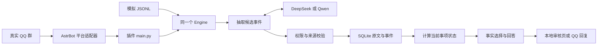

# AIE3905 企业群聊助手：总结交付文档

版本：v0.1.1（学习与集成验证版）  
日期：2026-09-28  
读者：理解项目目标、尚不熟悉技术实现的新组员

## 1. 本次交付结论

选择 `AIE3905_GroupBot_v0.1.0.zip` 中的 groupsecretary 实现作为继续开发的主线。本次产出可以在 Mac 上运行本地演示、查看事项与原文、生成多种噪音的虚构群聊、回放并输出检查结果；已准备 DeepSeek／Qwen 接入配置和真实 QQ 群的操作教程。

**完成的是可运行的开发与测试交付，尚未完成真实云模型与 QQ 的端到端接入。** API Key、QQ 登录和测试群配置需要部署者在自己设备上操作。本版没有宣称模型准确率、真实 QQ 撤回兼容或生产可靠性。

原始附件中的部署建议、待办和企业合作描述被作为背景材料分析，未作为自动授权。企业内部数据试点尚未确认。本次数据均为虚构内容。

## 2. 两份平行实现如何选择

| 项目 | A：group_ledger，标记 0.3.0 | B：GroupBot／groupsecretary，原版 0.1.0 |
| --- | --- | --- |
| 与用户交接文档的关系 | 不是文档对应的源码包 | SHA-256 与交接文档一致 |
| 抽取方式 | 条数／静默窗口批量抽取 | 逐条增量抽取，提供近期消息与候选事项 |
| 工作回答 | 自由正文加部分事实检查 | 模型选择已给定事实，程序呈现事实与依据 |
| 队列与证据 | 已复现恢复、撤回依赖、删除清理问题 | 持久化状态、有限重试、较完整的来源依赖处理 |
| 交互工具 | 静态展示和反馈入口 | 本地审核工作台、查询、确认、反馈与原文 |
| 可借鉴部分 | 批量调度、中文时间候选、变化型群报 | 当前继续开发的基础 |

两套实现不是按版本号递增的同一条开发线。A 的“0.3.0”不意味着比 B 的“0.1.0”更新或可靠。A 自带 15 项测试、B 自带 38 项测试，用例不同，不能用通过数量比较自然语言效果。

## 3. v0.1.1 的实际改动

| 改动 | 目的及边界 |
| --- | --- |
| `plugin/secretary/providers.py` 支持受限 `extra_body` | 允许 Qwen 的 `enable_thinking` 与 DeepSeek 的 `thinking` 进入原始 HTTP 请求顶层；不允许覆盖模型、消息或 JSON 格式配置 |
| 元数据与 Python 项目版本更新为 0.1.1 | 与新压缩包版本一致 |
| `run` 与 `lab.py` | 检查环境、启动演示／网页、单次模型连通、生成数据、回放评测 |
| 三类本地／云模型配置、两类 QQ 模板 | 将学习库、模型实验库与真实 QQ 库分开；真实群模板默认关闭 |
| 可复现数据生成器 | 随机种子、噪音比例、交错事项、命令／自然语言双版本、独立断言文件 |
| 评测结果 | 输出状态与回答断言通过率、失败数、延迟、处理速度和模型 token 用量 |
| 文档、补充测试与打包脚本 | 帮助新组员复现和接手；压缩包不包含虚拟环境、运行数据库或凭据 |

**没有合并 A 的核心实现，没有修复 B 的所有已知缺陷，也没有训练模型。** 新版本号表示本次开发交付的增量。

## 4. 技术结构

QQ 与模拟器只负责把消息送入系统；它们共用记忆、抽取、权限和回答逻辑。模型提供候选解释，程序决定哪些事实可以生效。工作回答受到事实选择约束，但上游抽取错误仍可能造成错误记忆。

理解模型 `understanding` 与回答模型 `answering` 是两个职责，首次接入可以共用一个模型和一把 Key。配置中的 `mode: openai` 表示兼容的 HTTP 协议，也可调用 DeepSeek／Qwen；`mode: astrbot` 表示由宿主管理服务与凭据；`mode: demo` 完全不调用模型。

## 5. 已验证与未验证

| 验证项 | 本次状态 |
| --- | --- |
| Mac arm64／Python 3.13.5 运行 | 已运行 |
| 原包 38 项测试 | 全部得到通过验证；4 项网络测试需允许绑定本机端口后重跑 |
| 新增 3 项实验台测试 | 通过：请求体参数、禁止覆盖核心参数、数据可复现及证据顺序 |
| 默认 80% 噪音命令回放 | 60 条消息、12 检查点，状态与回答断言均通过，处理失败 0 |
| 原版自带 7 个功能回归 | 前轮分析已通过，历史结果一并保留 |
| 本地浏览器实际操作 | 已验证令牌连接、事项显示、查询回答与原文依据按钮展示 |
| DeepSeek／Qwen 的真实请求 | 未执行；没有使用用户 API Key |
| AstrBot 完整宿主、真实 QQ 收发 | 未执行 |
| QQ 全量消息、引用、撤回 | 待真实平台逐项验收；模拟撤回不等于平台撤回已接通 |
| 自然语言性能、成本、并发与大群容量 | 未得出结论 |

详细日志和评测文件位于 `results/`。指标都是本机相应运行条件下的记录，不能替代真实群实测。

## 6. 当前必须保留的已知问题

1. **更正权限漏洞**：普通成员更正自己已接受的备注时，可以新增时间字段，使其变成正式安排。备注与决定的权限边界尚未重做。
2. **更正动作丢失**：只更正取消原因，可能把 `cancelled` 恢复成 `confirmed`；原动作语义没有被保留。
3. **自然语言更正目标不足**：抽取输入通常只含待确认事件 ID，缺少已接受事件 ID，模型难以准确引用更正目标。
4. **时间解析不够保守**：周期可能被压成单日，“下下周”可能少一周，“九点”可能被直接当上午九点。
5. **旧提议未充分收起**：独立正式决定后，旧提议仍可能继续显示为待确认。
6. **同名事项合并**：事项 ID 依赖群与标题；同群两个同名活动可能错误合并。

前两项是进入多人真实试点前优先修复的正确性问题。本版适合开发、合成数据验证和受控测试群学习，不能直接据此宣称可承担正式业务决定。

修复顺序建议：更正权限和动作语义 → 向模型补充可更正事件 → 时间歧义与事项身份 → 真实模型回放 → QQ 集成验收 → 批量抽取和成本优化。A 的机制应作为参考移植，不能让两个引擎写同一个数据库。

## 7. 交付与接手

完整包 `AIE3905_GroupBot_v0.1.1.zip` 包含源码、教程、配置、数据、结果和构建工具。独立包 `astrbot_plugin_groupsecretary_v0.1.1.zip` 仅供 AstrBot 插件安装。`SHA256SUMS.txt` 用于核验下载文件，包内 `MANIFEST.sha256` 用于核验内容。

建议新组员按顺序完成四个可观察的里程碑：

1. 本地网页里解释一次改期，并能点击来源验证；
2. 在自己终端隐藏输入 Key，完成一个 JSON 连通请求；
3. 同一自然语言数据分别跑 DeepSeek／Qwen，阅读失败案例与用量；
4. 在自己管理的 QQ 测试群验证普通消息、引用、身份与撤回，再评估是否扩大试点。

具体命令与验收条件见另外两份教程。历史审查报告保留在 `docs/reviews/`，其中临时目录路径属于当时审查记录，不作为新包的运行路径。
