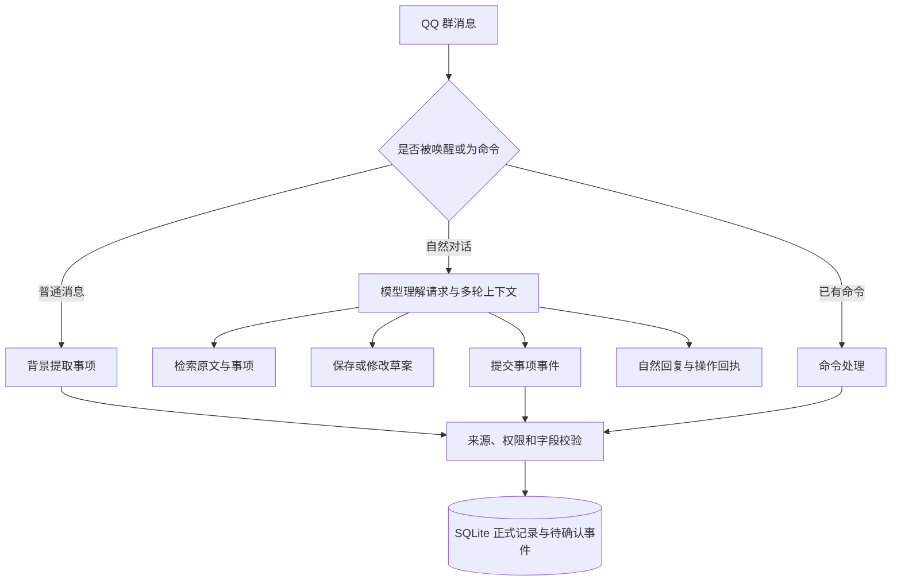

# 群聊助手 v0.2.0 交付说明

日期：2026-09-28。目标：开放对话与方案协作，把严格校验集中在正式事项写入、权限、来源及数据隔离处。

## 1. 现在能做什么

- 在已配置的 QQ 测试群中持续接收普通消息；普通消息不触发回复。
- 被 @ 或收到 `/聊` 时理解需求，讨论、写方案、修改草案、分析群聊和查询事项。
- 机器人提出的方案保存为草案；授权成员可说“就按刚修改的方案定了”，由程序记录正式事项。
- 未授权成员也可提出方案和确认意见，但正式事项仍保持待确认。
- 保留 `/问`、`/回溯`、`/群报`、`/事项`、`/记事`、`/确认` 等原有命令。严格查询现在是一个可选入口。
- 既有 SQLite 消息和事项继续使用；升级不重新提取历史消息。

没有新增联网搜索、定时提醒、主动通知或外部应用操作。图片、语音仍是未解析附件，不能当成已经看懂。

## 2. 如何在 QQ 验收

每一步等待机器人回复后再发下一步，前三步由当前已配置的确认人发送：

1. `@机器人 帮我们设计集成评审的两套开会安排。日期是2026年10月2日，地点都在三楼讨论室。方案1晚上8点，方案2晚上9点。先给建议，不要定案。`
2. `@机器人 第二个方案提前半小时，其他保持不变。`
3. `@机器人 就按刚修改的方案定了。`
4. `@机器人 最终的集成评审怎么安排？`

预期：生成两套建议；方案2改为20:30；第三步后正式记录；第四步说明20:30与地点，并带简短依据。只有机器人自己说“已记录”不能作为数据库验收，须核对回复的“事项处理”回执和 `/事项`。

可再试：`@机器人 分析一下我们最近的讨论，给出下一步建议`、`@机器人 写一段轻松的会议开场白`。这类请求应自然回答，不必要求已存在确认事项。

引用其他成员的草案时，优先直接引用机器人原回复。当前 QQ 宿主发送接口不返回消息ID，插件在收到引用原文时使用同群唯一、完全匹配的回复定位；引用原文缺失或不唯一时不能可靠定位，会要求说明方案。不要把这项能力理解成所有 QQ 引用形式都已验收。

## 3. 处理链路



对话模型与提取模型仍由 `models.answering`、`models.understanding` 配置，当前均使用既有 DeepSeek Provider。对话无需新增第三方 Python 依赖或工具调用 SDK。

模型通过 JSON 请求四种受限工具：`search_messages`、`read_items`、`save_drafts`、`submit_events`。每次对话最多4次模型调用、8次工具调用；对话处理总超时45秒，不包括排队等候。正式写入每个请求只能提交一批，经过原有事件校验，不能由模型指定群、调用者或确认权限。

上下文包括最近16条普通群消息、当前成员最近6条回答及当前草案，按约24000字符预算裁剪。工具历史另有总大小上限。当前成员的历史请求保存在回答对话中，避免其他成员的方案串入当前对话。旧记录按需检索，并非全量群聊都能装进一次模型请求。

## 4. 数据与兼容

新增草案、对话请求缓存，及事件溯源字段。数据库自动增量迁移为schema version 2。旧命令和 `/api/query` 的响应字段不变。

- 当前请求不会作为自身查询结果的依据。
- 被唤醒的自然消息仅走对话写入路径，避免与后台提取重复写入。
- 重复的 HTTP `request_id` 返回先前结果；相同ID换内容会拒绝。
- 草案版本持久化，重启后仍可采用有效草案；修改旧草案会使旧版本不可再次采用。
- 撤回、退出记录、删除与保留期清理会清除派生草案及对话缓存。为避免残留转述，现阶段采用保守的群级派生缓存清理。
- 修复备注更正越权修改正式字段、取消原因更正使事项恢复确认两处缺陷。

`{"dialogue":{"enabled":false}}` 可关闭新入口并回到旧对话路由。该开关是功能回退，不撤销已经写入的记录。

## 5. 实际验证结果

| 验证 | 结果与边界 |
| --- | --- |
| 插件自动测试 | 64项通过，覆盖核心、HTTP、适配器契约、模型契约与20项新增对话测试 |
| 学习工具测试 | 3项通过 |
| 原有80%噪音命令回放 | 60条消息、12个检查点全部通过；这是规则回归，不是LLM准确率 |
| 真实DeepSeek虚构对话 | 7轮、8项验收断言通过；15次模型调用，23536输入token、1684输出token |
| 真实模型延迟 | 该小样本中位数1.694秒，最大4.077秒；不含真实QQ网络发送 |
| 权限样本 | 普通成员确认新人交流会后仍待确认，未出现越权正式确认 |
| 数据迁移 | 在当前QQ库的临时副本上验证，原四张核心表行数保留 |

真实模型测试通过直接兼容API调用，**不等于已经完成新版本真实QQ收发验收**。前两次联调出现过上下文串线、重复要求确认和漏引文，相关记录保留用于复盘；最终报告为 `results/dialogue-deepseek-v0.2.0.json`。时间断言接受等价表达“20:30”和“晚8点30分”，最终结果按这条规则重算，未额外调用模型。

模拟模型测试负责验证程序边界，不能证明自然语言意图识别准确率。模型仍可能误解方案或选错来源；新对话层不再逐句用固定模板约束生成。来源ID校验不等于语义引用正确性证明。

## 6. 模拟环境

先阅读 `docs/接口与模拟测试.md`。新增数据集 `datasets/dialogue-small/scenarios.json` 和隔离回放脚本：

```sh
.venv/bin/python tools/replay_dialogue.py --config config/deepseek.json --noise 0.5 --seed 42 --output results/dialogue-noise50.json
.venv/bin/python tools/replay_dialogue.py --config config/qwen.json --noise 0.8 --seed 42 --max-calls 160 --output results/dialogue-noise80.json
```

在终端隐藏输入Key，或从环境变量提供。脚本每次使用临时数据库，不接触真实QQ库；固定种子生成背景闲聊，按顺序回放7轮任务。报告任务通过率、未授权正式确认数、来源ID可访问率、延迟、调用及token用量。50%/80%的新对话噪音测试尚未作为本次真实模型结果执行；上述命令用于下一轮评测。

## 7. 已知限制

- 多事项同名合并、复杂周期时间解析、独立确认后旧提议未必完全合并等原有问题仍需专项评测。
- 自然语言意图判断由模型完成，不承诺任意表达都能正确选择方案。明确引用和完整事项名称更可靠。
- 模型建议不代表场地真实可用或参与人已有空闲，需要成员确认。
- 当前没有逐句事实核验器；严格核验适用于正式写入及显式查询。
- 真实QQ引用、撤回事件的适配仍依赖平台实际交付，不能用模拟测试代替。

## 8. 交付物

- `dist/AIE3905_GroupBot_v0.2.0.zip`：完整源码、模板、文档、虚构数据集与测试。
- `dist/astrbot_plugin_groupsecretary_v0.2.0.zip`：AstrBot 插件安装包。
- `dist/SHA256SUMS.txt`：压缩包校验值；每个包内含文件清单。

运行数据库、真实群配置、凭据和宿主备份不进入交付包。原始v0.1.1交付说明作为历史记录保留。
