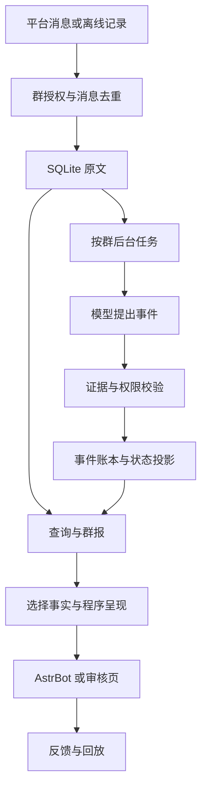

# 工程结构与扩展位置

## 数据流

系统保持一条正式写入链路。平台处理函数记录消息后很快返回，重操作由后台任务执行。数据库保存待处理状态，内存 Event 只负责唤醒，因此进程重启可以继续处理待办。

初版按消息增量处理，每群串行、各群共享最多两个模型并发槽；不是全量历史反复输入，也不是高吞吐批推理服务。跨消息批处理和专用向量索引是后续优化点。

查询等待提问之前的消息处理完成，等待上限可配置。超过上限时仍只读现有状态，明确提示覆盖不完整；**没有第二条临时视图写入链路**。这是首版对 v0.3 方案的简化。

## 文件职责

| 文件 | 职责 |
| --- | --- |
| `main.py` | AstrBot 事件入口、发送、后台回复任务、独立撤回桥接 |
| `secretary/types.py` | 消息、群、访问者与事件类型 |
| `secretary/config.py` | 配置和启用条件 |
| `secretary/store.py` | SQLite、去重、原文、事件、反馈、删除及处理进度 |
| `secretary/memory.py` | 模型候选校验、确认权限、事件投影、关键词排序 |
| `secretary/extract.py` | 确定性命令、引用留存、小模型事件抽取 |
| `secretary/timeparse.py` | 保守的相对日期解析；含糊时保留原话 |
| `secretary/answer.py` | 事实条目、选择、固定呈现与闲聊风格 |
| `secretary/engine.py` | 后台处理、查询、命令、群报、反馈与任务生命周期 |
| `secretary/providers.py` | OpenAI 兼容 HTTP / AstrBot Provider |
| `secretary/web.py`、`secretary/ui/` | 有鉴权的本地审核页面与 API |
| `secretary/cli.py` | 演示、离线导入、独立服务 |
| `secretary/evaluate.py` | 按时间回放、基线比较、配对区间 |
| `tests/` | 状态、权限、删除、HTTP 与 AstrBot 接口模拟测试 |

## 账本语义

原文、事件与当前状态分离。事件保存来源、对象、时间、作用范围、确认状态、模型与提示版本。当前状态从事件计算，不让模型任意改写整段长期摘要。

- 提议不会自动变成正式安排。确认依据来自群配置。
- “可以”需要回复关系或模型可靠关联到具体事件，确认时保留对原提议的依赖。
- 独立重述完整事实的确认，可以拥有独立证据。
- 一个成员缺席只更新个人状态，不取消整场活动。
- 单次改期只写指定日期的 occurrence，不改系列。
- 撤回会使依赖事件失效。缺少独立新确认时，状态变为不确定，不默认恢复旧安排。
- 更正与普通变更不同：更正有目标事件，普通变更保留时间线。
- 重新描述的时间仍含糊时，不沿用旧的精确时刻。

程序校验能阻止字段错误、跨群证据、未来证据、越权确认和非法引用，但**不能保证模型的语义归属一定正确**。多个近似事项需要通过审核与回放不断改进。

当前事项 ID 由群和规范化标题构成。模型负责复用准确标题；完全同名但独立的事项应使用不同标题，或以后增加别名、拆分与合并流程。程序不会擅自把同名事项视为两个对象。

## 一致性与恢复

- 原生消息去重使用群、消息 ID、事件类型和修订号。不同 AstrBot 实例要映射到不同的群配置 key。
- 无原生 ID 的离线记录使用数据集版本和行号。内容摘要用于发现疑似重复、阻止已删除内容恢复，不将所有同文消息直接合并。
- 事件 ID 由消息 UID 与候选序号构成，重复处理不重复插入。
- 状态事件和处理进度同一事务提交。进度值是“最后完成的序号”，不是无缺口的成功保证；查询还要检查失败、待办和附件状态。
- 每群一个处理锁；SQLite WAL；单库进程锁防止两个 Engine 同时写。
- 模型调用失败按次数重试，超过次数保留 `failed`。后台不会无限重试。
- 撤回、删除和到期清理改变群撤销版本；生成回答前后检查版本，避免使用已经清理的快照。
- 插件关闭时取消并等待任务，关闭审核服务，释放数据库与写入锁。

## 模型、回答与体验

小模型输出 JSON 候选事件，程序校验后才能写入。近期消息、原文检索和候选事项提供上下文；模型没有文件、Shell、下单、删除或发消息的工具权限。

工作回答先形成与事项绑定的事实条目。主模型只能选择条目 ID 和开场句，不能修改时间、人员或状态字段；失败时退回模板。原文保留覆盖全部获准历史的 FTS5 / BM25 检索通道，用中文二元词片补足基础分词；不支持 FTS5 时回退全文关键词扫描。找到原话但没有状态时会明确说明。索引与原文同事务写入，并随删除清理。

这使首版事实更可核对，但表达自由度有限。进一步优化语言时，可以把模型生成与逐项事实校验接在 `Answerer` 后，必须保持引用和时间版本的测试。

闲聊走独立入口，使用群内 persona 和少量近期语境。直接问好、感谢及 `/聊` 可以触发；不会因为每条消息进入监听器就逐条接话。冲突提醒默认关闭，开启后只提醒高置信度的新时间冲突，并有冷却。

定时群报需要配置 `report_time`，并且先收到该群的真实消息以取得发送会话。独立工作台只支持手动群报，没有外部发送通道。群报的定时送达是尽力而为：崩溃发生在平台发送与本地记账之间时可能重复，需真实平台进一步验证。

## 数据与评测

消息正文不写入异常日志；HTTP 请求日志关闭。回答记录来源、涉及事项、模型与提示版本；反馈记录到具体回答。成本统计包含后台提取、回答、失败重试及比较基线；AstrBot Provider 不提供用量时保存未知值，不虚构 token 数或费用。

回放评测按时间逐步入库，提问只能看到之前的消息。功能回归不调用外部模型；`--compare` 使用相同回答 Provider 做全文和关键词基线。自动断言只检查声明内容和来源 ID，不证明语义正确，也不代替企业数据测试。

## 首轮之后如何扩展

1. **向量召回**：在事项候选与原文检索之前加入可替换 retriever。嵌入缓存也必须纳入群权限、删除和保留期限。
2. **批处理与容量**：将同一短窗口的事件抽取合并成一次调用；保留逐条来源和幂等键。先量出每分钟消息量、队列积压与总 token。
3. **多模态**：增加经过批准的附件识别 Provider，输出带图片证据的候选；不可绕过现有写入校验。
4. **参与判断器**：从已有响应决定和反馈中标注训练集，比较规则与小模型。不要把没人回复直接当作负奖励。
5. **记忆策略学习**：固定保留测试集，对事件关联或更新策略做监督学习，再考虑离线 RL。版本化策略，验证后上线，保留回退。
6. **企业 Agent**：优先读取已有鉴权的事项 API 和来源。后续另行设计服务间认证、平台深链接和业务动作权限。

本版没有自动修改模型权重、自动重写自身代码或执行外部业务操作。
